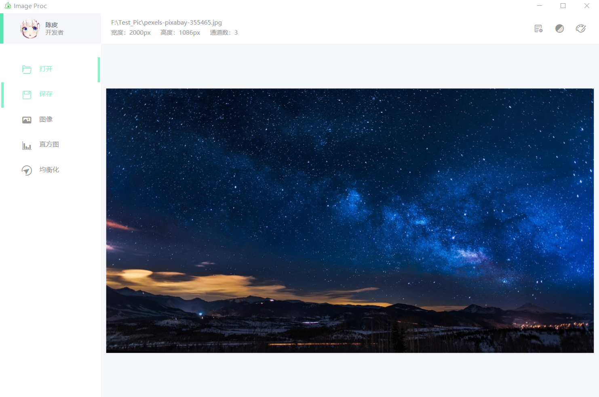
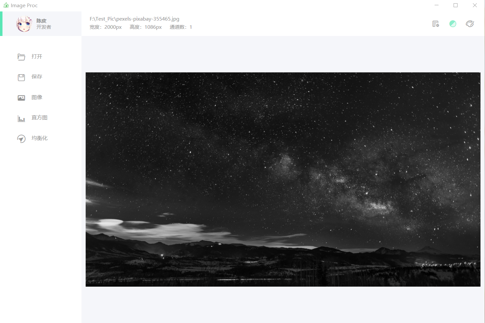
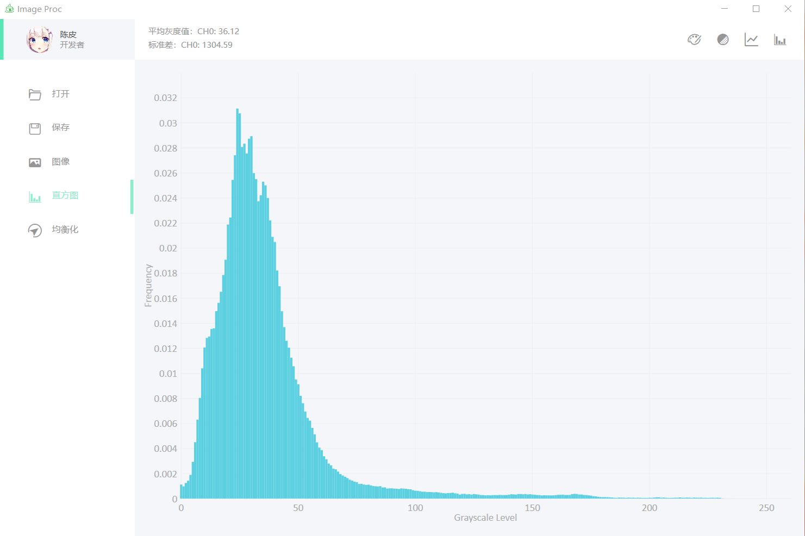
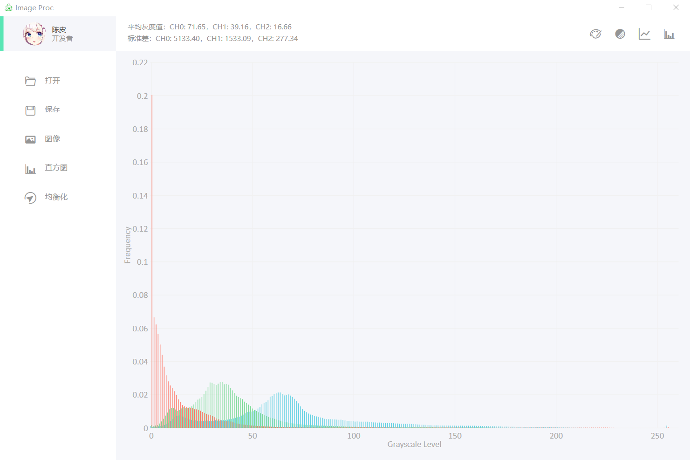
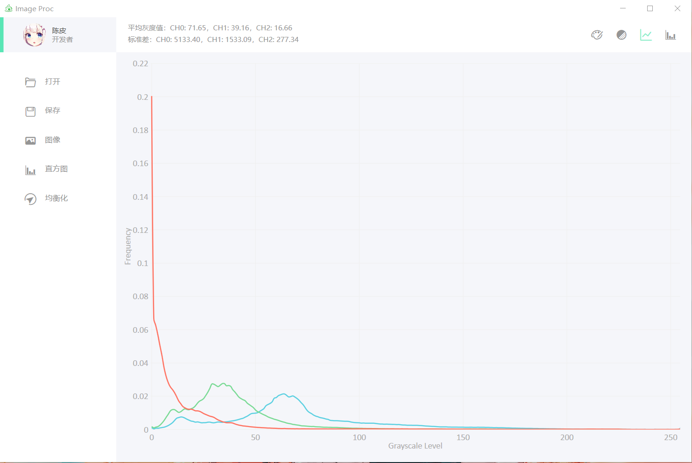
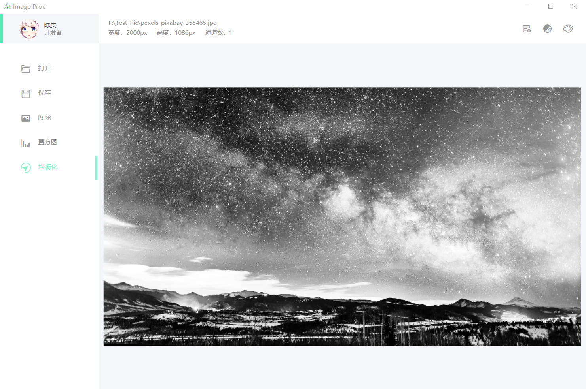

# Image Proc —— The Application of Image Processing
---

### 1. Requirement
+ .Net Framework (version >= 4.7.2)
+ OpenCV (version >= 4.5.0)

### 2. Introduction
+ 主界面 
    
    主界面包含打开图片、保存图片、显示图像、显示图像直方图和图像均衡化等功能。

+ 显示图像 
    
    
    图像显示功能可切换灰度图显示和彩色图片显示，为提高UI响应速率，界面显示的图像像素默认为1024 pixel。

+ 直方图
     
    
    
    直方图功能可显示多通道图像的直方图或其灰度图的直方图，并支持以柱状图或线性图的方式呈现结果。

+ 均衡化结果
    
    支持多通道图像和单通道图像的直方图均衡化。